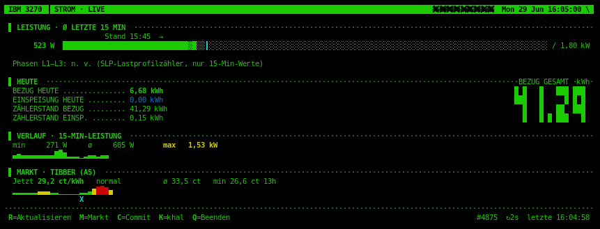

# strom

**Live-Dashboard für Smartmeter** (inexogy / vormals Discovergy) als
Terminal-Tool – htop-artige Bedienung in IBM-3270-Phosphor-Optik, optional mit
**Tibber-Marktpreisen**, **Zählerstand-Commit** (Opt-in + 2FA) und einem
**Web-Export** (HTML/PHP) inklusive Ampel-Empfehlung fürs Handy.



Nur Python-Standardbibliothek – keine Pakete nötig. Die Live-Werte kommen über
die inexogy-REST-API (HTTP Basic Auth); ein Hintergrund-Thread pollt den Zähler,
die curses-Oberfläche bleibt flüssig und blockiert nie auf dem Netz.

> **Whitelabel:** Beim ersten Start fragt ein Assistent die nötigen Zugangsdaten
> ab und legt die Konfiguration an. Branding (`brand=`), Export-Ziel und
> 2FA-Absender sind frei konfigurierbar – keine Anbieter- oder Personendaten im
> Code.

## Voraussetzungen

- **Python ≥ 3.8** (Standardbibliothek genügt, inkl. `curses` – unter Linux/macOS
  vorhanden).
- Ein **inexogy-Konto** mit Smartmeter (E-Mail + Passwort).
- Optional: **Tibber-Konto** für Marktpreise (Developer-Token empfohlen).
- Optional: **[himalaya](https://github.com/pimalaya/himalaya)** CLI für den
  2FA-Mailversand beim Zählerstand-Commit.
- Optional: ein **Webspace/Server mit PHP** für den Handy-Export.

## Installation

```sh
git clone <REPO-URL> strom
cd strom
ln -s "$PWD/strom" ~/.local/bin/strom    # ~/.local/bin muss im PATH sein
strom                                    # erster Start → Einrichtungs-Assistent
```

Der Assistent (`strom setup`) fragt inexogy-Login, optional Tibber und
Web-Export ab und schreibt `~/.config/strom/config` (Modus 600). Danach startet
`strom` direkt das Dashboard.

Man-Page (optional):

```sh
man -l strom.1                                        # direkt ansehen
sudo install -m644 strom.1 /usr/local/share/man/man1/ && sudo mandb && man strom
```

## Benutzung

```sh
strom                # interaktives Live-Dashboard (TUI)
strom now            # einmalige Momentaufnahme (Klartext)
strom watch [SEK]    # Momentaufnahme alle SEK Sekunden (Default 5)
strom markt          # Tibber-Marktpreise heute (Klartext-Tabelle)
strom export [PFAD]  # HTML/PHP-Seite schreiben (Default aus export_path)
strom commit         # aktuellen Zählerstand an Tibber senden (Opt-in + 2FA)
strom meters         # alle Zähler des Kontos auflisten
strom setup          # Einrichtungs-Assistent (Konfiguration neu anlegen)
strom test           # Verbindung/Login prüfen
strom version | help
```

In der TUI: **[R]** aktualisieren, **[M]** Markt-/Preistabelle, **[C]**
Zählerstand an Tibber, **[K]** khal-Infos, **[Q]** beenden. Das Dashboard zeigt
die aktuelle Leistung (Balken), den Verbrauch seit Mitternacht, die Zählerstände
(Gesamt-Bezug zusätzlich als große 80er-LED-Ziffern), einen 15-Min-Verlauf und –
wenn Tibber konfiguriert ist – ein **MARKT**-Panel mit aktuellem Preis,
Tagesverlauf und günstigster Stunde. Einspeisung (negative Leistung) wird
markiert.

## Konfiguration

`~/.config/strom/config` (Modus 600, `KEY=WERT` je Zeile). Umgebungsvariablen
haben Vorrang. Beispiel siehe [`config.example`](config.example).

| Key | Pflicht | Bedeutung |
|-----|---------|-----------|
| `email`, `password` | ✓ | inexogy-Login |
| `meter_id` | | Zähler-ID (sonst automatisch ermittelt) |
| `interval` | | Sekunden zwischen Live-Abfragen (Default 2) |
| `chart_height` | | Zeilenhöhe der Charts (0 = automatisch) |
| `brand` | | Label oben links (Whitelabel; Default `IBM 3270 ▐ STROM`) |
| `tibber_token` | | Developer-Token von developer.tibber.com (bevorzugt) |
| `tibber_email`, `tibber_password` | | Fallback statt Token (App-Login) |
| `tibber_home` | | appNickname-Teil oder Index, sonst erstes Home |
| `tibber_commit` | | `on` schaltet den Zählerstand-Commit frei (Default aus) |
| `commit_email` | | Ziel des 2FA-Codes (Default: `email`) |
| `mail_from` | | Absender des 2FA-Codes (Default: `commit_email`) |
| `export_path` | | Ziel von `strom export` (Default `~/strom.php`) |

Passende Umgebungsvariablen: `STROM_EMAIL`, `STROM_PASSWORD`, `STROM_METER`,
`STROM_INTERVAL`, `STROM_CHART_HEIGHT`, `STROM_BRAND`, `STROM_TIBBER_TOKEN`,
`STROM_TIBBER_EMAIL`, `STROM_TIBBER_PASSWORD`, `STROM_TIBBER_HOME`,
`STROM_TIBBER_COMMIT`, `STROM_COMMIT_EMAIL`, `STROM_MAIL_FROM`,
`STROM_EXPORT_PATH`, `STROM_CONFIG_DIR`.

## Web-Export für unterwegs (`strom export` / Cron)

Schreibt eine in sich geschlossene, handy-taugliche **HTML/PHP-Seite** mit
aktueller Leistung, Tagesverbrauch, Zählerständen, Tibber-Preisen und einer
**Ampel-Empfehlung**, ob/wann sich stromintensiver Betrieb lohnt (🟢 günstig /
🟡 normal / 🔴 teuer, inkl. nächster günstiger Stunde). Reine Anzeige, **kein**
Schreibzugriff auf Tibber.

Die Werte werden beim Erzeugen fest in die Seite geschrieben; der PHP-Kopf setzt
No-Cache-Header und ein `<meta refresh>` lädt am Handy selbsttätig nach. Ziel ist
`export_path` (oder `$STROM_EXPORT_PATH`) – z. B. ein per sshfs gemounteter
Webspace.

Nicht-interaktiv und damit cron-tauglich über `timed_export.sh` (prüft optional
einen Mount, schreibt atomar, loggt):

```sh
*/10 * * * * /pfad/zu/strom/timed_export.sh >> /pfad/zu/strom/export.log 2>&1
```

## Zählerstand an Tibber senden (`strom commit` / TUI **[C]**)

Sendet den aktuellen inexogy-Zählerstand an Tibber (GraphQL-Mutation
`sendMeterReading`). **Schreibender, abrechnungsrelevanter Eingriff** – darum
dreifach abgesichert:

1. **Opt-in**: erst mit `tibber_commit=on` aktiv (Default aus).
2. **Wertbestätigung**: der vorgeschlagene kWh-Wert ist immer editierbar.
3. **2FA**: ein 6-stelliger Code wird per `himalaya` an `commit_email` geschickt
   und muss eingegeben werden.

## Einheiten

Die API liefert Rohwerte; `core.py` rechnet um (empirisch bestätigt):

| Feld | Rohwert | Umrechnung |
|------|---------|------------|
| `power`, `power1..3` | Milliwatt (mW) | Watt = roh / 1000 |
| `energy`, `energyOut` | 10⁻¹⁰ kWh | kWh = roh / 1e10 |

SLP-Lastprofilzähler liefern keine echte Momentanleistung – dann zeigt das
Dashboard die mittlere Leistung der letzten 15-Min-Stufe und blendet L1–L3 aus.

## Aufbau

Funktion, Inhalt und Oberfläche getrennt:

```
strom                  # dünner Launcher
stromzaehler/
  config.py  – Zugangsdaten & Einstellungen laden
  wizard.py  – interaktiver Erststart-Assistent (Config anlegen)
  brand.py   – Whitelabel-Label der Statusleiste
  api.py     – REST-Client der inexogy-API (Basic Auth, nur stdlib)
  core.py    – Einheiten-Umrechnung, Kennzahlen, Session-Historie
  markt.py   – Tibber-Marktpreise + sendMeterReading (GraphQL)
  commit.py  – Zählerstand-Commit mit Opt-in + 2FA
  export.py  – HTML/PHP-Seite mit Empfehlung (Web-Export, cron)
  mail.py    – 2FA-Code-Versand über himalaya
  khal.py    – Erinnerungs-Export nach khal (Stub, geplant)
  theme.py / render.py / tui.py  – Retro-Terminal-UI (Klartext bzw. curses)
  cli.py     – Einstieg / Befehlszeile
```

## API

- inexogy-REST-API: `https://api.inexogy.com/public/v1` ·
  Doku `https://api.inexogy.com/docs/` · HTTP Basic Auth (E-Mail/Passwort).
- Tibber-GraphQL: `https://api.tibber.com/v1-beta/gql` ·
  Token: `https://developer.tibber.com/`.

## Lizenz

Siehe [`LICENSE`](LICENSE).
